# Earth on Canvas dataset
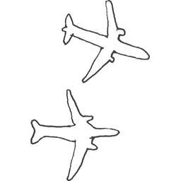 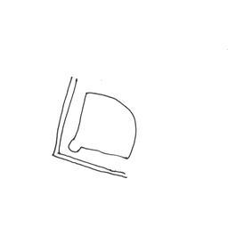 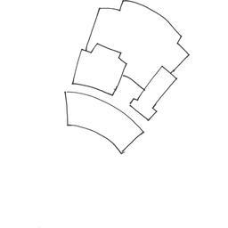 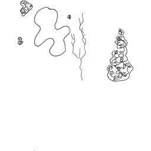 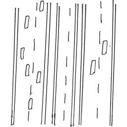 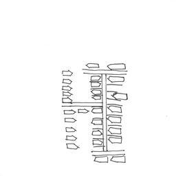 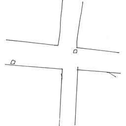 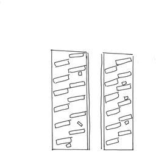 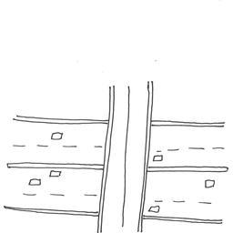 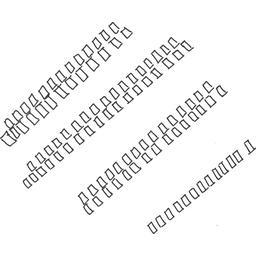 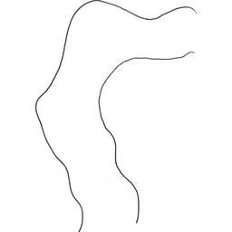 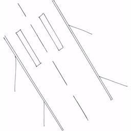 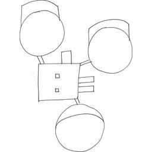 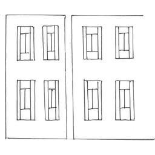

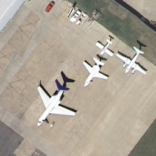 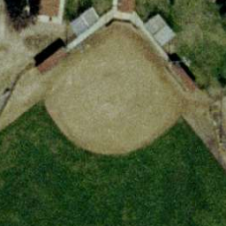 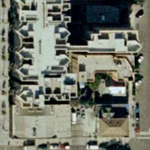 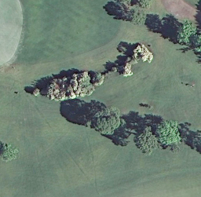 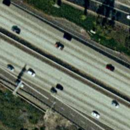 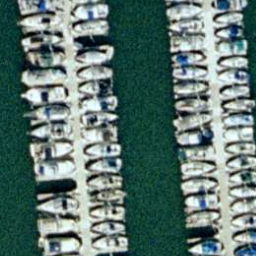 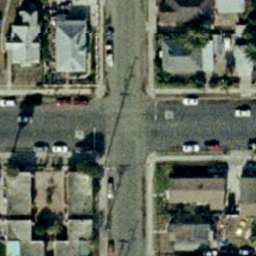 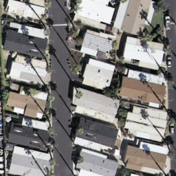 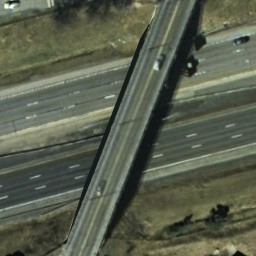 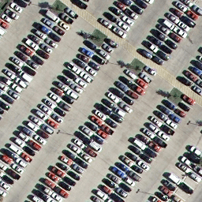 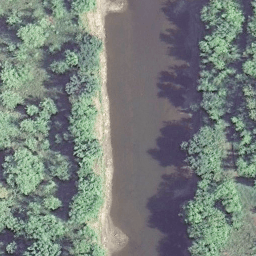 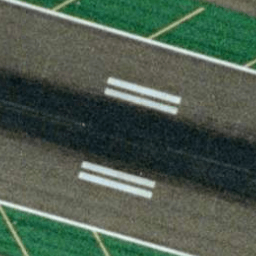 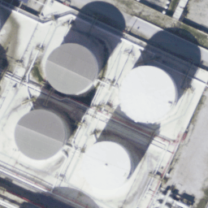 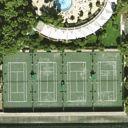

## A Zero-Shot Sketch-based Inter-Modal Object Retrieval Scheme for Remote Sensing Images

Download the dataset from [here](https://drive.google.com/file/d/1bCElAva8lA-BCUHrAQkDu_CK0Cb7O7cD/view?usp=sharing)

### Classes in this dataset:
1. Airplane
2. Baseball Diamond
3. Buildings
4. Freeway
5. Golf Course
6. Harbor
7. Intersection
8. Mobile home park
9. Overpass
10. Parking lot
11. River
12. Runway
13. Storage tank
14. Tennis court


Full codes coming soon!!!


## Paper

*    The paper is also available on ArXiv: [A Zero-Shot Sketch-based Inter-Modal Object Retrieval Scheme for Remote Sensing Images](https://arxiv.org/pdf/2008.05225.pdf)

*   Feel free to cite the author, if the work is any help to you:

```
@InProceedings{Chaudhuri_2020_EoC,
author = {Chaudhuri, Ushasi and Banerjee, Biplab and Bhattacharya, Avik and Datcu, Mihai},
title = {A Zero-Shot Sketch-based Inter-Modal Object Retrieval Scheme for Remote Sensing Images},
booktitle = {http://arxiv.org/abs/2008.05225},
month = {Aug},
year = {2020}
} 

**Bold** and _Italic_ and `Code` text
`
